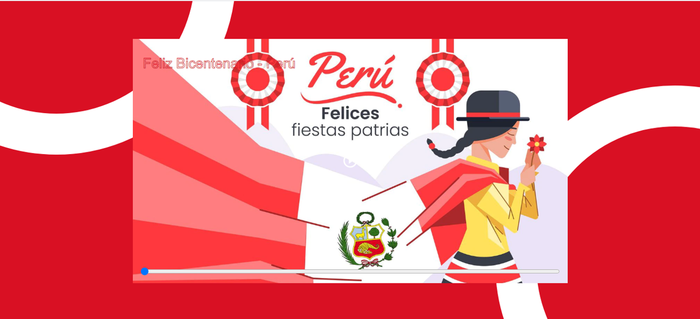
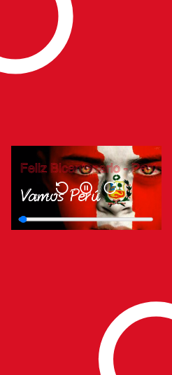

# video-player

Project Video-player, implemented from a design in Figma [course intro to web development](https://leonidasesteban.com/cursos/desarrollo-web).

## Desktop

## Mobile

### Feautes

- Title, control buttons and bar progress on hover
- Mobile responsive

### Links
- [Website](https://estebanpajares.github.io/video-player/)
- [Figma](https://www.figma.com/file/aM9B2YUmbIpqb3pRAgnZVD/Video_Player?node-id=4%3A8)
- [Video Player](https://leonidasesteban.com/proyectos/video-player)